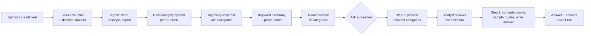

# SurveyAnalyzer — The Complete Product Guide

*Last updated 2026-08-03. Everything in this guide describes what is actually
built and measured — not plans. Where a number appears, it was computed from a
real run.*

---

## 1. What this is

Cities and organizations run surveys with open-ended questions — "What would
make San José better?" — and get back thousands of free-text answers. Today,
making sense of those answers means a person reading every comment and
hand-tallying themes in a spreadsheet. It takes weeks, it doesn't scale, and
at the end nobody can check the tally against the source comments.

SurveyAnalyzer replaces that with a system where an analyst types a
plain-English question —

> *"When residents mention affordability, what specific costs are they
> referring to?"*

— and gets back a written answer **grounded in the actual responses**: real
counts computed from the data, verbatim quotes, and a sources list where every
claim traces back to a specific row of the original spreadsheet.

It has processed a 599-respondent pilot survey and a ~29,000-response
production survey (5 open-ended questions from City of San José residents).
The full production run — from raw file to "ready to answer questions" — took
about 15 minutes and $6.75 in AI costs. Each question asked afterwards costs
about a penny and takes a few seconds.

### Who does what

- **The system** reads every response, builds a category system, tags every
  response with categories, and assembles evidence for answers.
- **The AI model** (Google's Gemini) proposes categories, tags responses, and
  writes the final answer prose. It is *never* allowed to produce a number —
  more on that below.
- **The analyst** approves the category system, reviews which categories an
  answer will draw from, and reads answers with full ability to drill into
  sources.

---

## 2. The five promises

These rules are enforced in code across every stage. They are what make the
output defensible.

1. **A model never produces a number.** Every count, percentage, and "most
   common" claim is computed by ordinary code counting real rows. The AI
   writes sentences *around* numbers it is handed and told to copy exactly.
   (This was audited across all 86 answers ever generated: zero invented
   numbers. See §9.)

2. **Every claim traces to source rows.** Quotes in an answer carry citation
   markers like [12] that resolve to the exact response, which resolves to
   the exact row of the uploaded file. An answer you can't drill into is an
   answer you can't defend.

3. **Empty results are correct results.** If the data can't answer a
   question, the system says "not answerable" rather than returning the
   nearest plausible-sounding match. A search system that always finds
   something produces confident wrong answers.

4. **Original data is immutable.** The uploaded file is stored byte-for-byte
   and never modified. All cleaning and tagging happens in separate,
   regenerable artifacts that reference the original.

5. **Human gates at the expensive, irreversible steps.** The category system
   gets human review before it becomes the foundation for everything else.
   The category selection for each answer is shown to the analyst for
   approval before the answer is written.

---

## 3. The big picture



Three phases, in plain words:

- **Getting data in** (§4): a spreadsheet becomes one clean row per response,
  with duplicates detected and handled.
- **Teaching the system the data** (§5): the AI reads the whole corpus and
  builds a two-level category system per question ("taxonomy"), then tags
  every response with the categories it matches. A human reviews the
  categories. This is the expensive part — it happens once per dataset.
- **Asking questions** (§6): each analyst question is routed to relevant
  categories, evidence is computed, and an answer is written and cited. This
  is the cheap part — it happens as often as you like.

Everything runs on your own machine (localhost). The only external service is
the Gemini API for the AI calls.

---

## 4. Getting data in

### 4.1 Upload and column selection

You upload a wide-format Excel or CSV file — one row per survey respondent,
one column per question. The system shows a preview and asks you to assign
each column a role:

- **Question** — an open-ended question to analyze. You must also type the
  actual question wording (e.g. "What makes the city feel unclean?"), because
  raw column headers like `q2oe` mean nothing to the AI. This is enforced:
  a blank or header-identical label is rejected.
- **Respondent ID** — optional; a column identifying the person.
- **Ignored** — everything else.

You also write a one-paragraph **dataset description** ("A 2026 resident
survey by the City of San José about..."). This description is fed into every
AI prompt downstream — it is what keeps category names consistent across
questions.

### 4.2 What ingest does to the data

- **Reshape**: the wide file becomes one row per (respondent × question) —
  a "response". Each response gets a permanent identity,
  `response_key = dataset:question:row`, that survives re-ingestion. All
  tagging keys off this, so re-running column selection never orphans work.
- **Encoding repair**: text mangled by earlier bad exports (`don’t` →
  `don't`) is fixed automatically, up to 3 repair passes. The original cell
  value is kept alongside the repaired one — cleaning is never destructive,
  and the manifest records exactly how many cells were touched.
- **Non-answer detection**: responses like "n/a", "none", "." are flagged
  (`is_nonanswer`) and skipped by all analysis — but stored and disclosed,
  never silently dropped.
- **Exports**: the working data is written to `data/exports/{dataset}/` as a
  Parquet file (typed, for the pipeline), a CSV (for humans/Excel), and a
  `manifest.json` — the audit record of how the source file became the
  output (column mapping, counts, repairs, timestamps).

The database (SQLite) is the source of truth; the exports are regenerable
artifacts. Deleting `data/exports` and re-exporting is always safe.

### 4.3 Duplicate uploads and appending new responses

Every raw row of every upload is fingerprinted (SHA-256 hash of the whole
row). When you upload a file, the system classifies it:

- **All rows already known** → "already ingested as dataset N", with a
  discard button. No duplicate dataset, no duplicate cost.
- **Some rows known** (e.g. you re-export the survey after 500 more people
  responded) → the system offers to **append** to the existing dataset: only
  the genuinely new rows are added, every existing response keeps its
  identity and its tags, and the incremental pipeline (§5.6) tags just the
  new rows for a fraction of the original cost.
- **Nothing known** → normal new-dataset flow.

The matching is deliberately strict (whole-row): a file with reordered or
renamed columns is treated as new data, because that's what it is.

---

## 5. Teaching the system the data (the processing pipeline)

All of this runs from one **"Process this dataset"** button in the browser
(or stage-by-stage from the command line). The button first shows a **free
cost estimate**, and only runs after you confirm. On the production file the
estimate was $8.59 and the actual was $6.75 — estimates deliberately run
~25% high, the safe direction for a spend gate.

### 5.1 Building the category system ("taxonomy induction")

For each question, the AI reads the **entire corpus** — not a sample — in
shuffled chunks, and proposes candidate categories with evidence. The
evidence is by *reference*: responses are numbered in the prompt and the
numbers are resolved back to real rows in code, so a hallucinated quote is
structurally impossible — a made-up number simply doesn't resolve.

The candidates are then consolidated: near-duplicates merged, everything
organized into a two-level structure:

- **Parents** — a small set of broad themes shared across questions
  (housing, safety, cleanliness, homelessness, transportation...).
- **Children** — question-specific categories under them. This matters:
  "homelessness" under *what feels unsafe* means something different than
  "homelessness" under *what feels unclean*, and the children preserve that
  distinction while still rolling up to a shared theme.

Design detail worth knowing: no consolidation step's output scales with the
corpus size, which is what let the same pipeline handle 599 rows and 29,000
rows. Failed chunks skip and disclose themselves rather than killing the
run, and the expensive mapping phase checkpoints itself so an interrupted
run resumes without re-paying.

### 5.2 Tagging every response ("labeling")

With the category system frozen, every response goes through the AI in
batches and comes back with:

| Field | What it means |
|---|---|
| `label_ids` | Which child categories apply (can be several, can be none) |
| `uncategorized` | "None of the categories fit" — a **correct answer**, not a failure |
| `fit` (1–3) | The model's own rating of how well the categories covered this response |
| `locations` | Place names copied **verbatim** from the text (a guard drops anything not literally present) |
| `actionability` | `specific` (proposes a concrete action) or `general` (a broad wish/complaint) |
| `event_occurred` | Did this response recount something that actually happened to someone? |
| `respondent_key` | Same source row across questions = same person — powers cross-question analysis |

Guards: invalid category ids are dropped and counted; a response the model
skips is recorded as unlabelled, never silently lost; failed batches retry at
the end of the run and disclose themselves if they still fail. Measured
quality: ~0 invalid ids, 1–3% uncategorized, roughly $0.10 per 500 responses.
A 60-example human spot-check found 1 real error.

### 5.3 The keyword dictionary ("lexicon") — the non-AI second opinion

Alongside the category system, the system builds a keyword dictionary from
the corpus itself (frequent terms, capitalized names, common two-word
phrases), groups them into concepts with one AI call, and from then on
matches them with **deterministic pattern matching — no AI involved**.

Why two layers? The taxonomy answers "what is this response *about*"; the
lexicon answers "what does it literally *mention*". They fail in different
ways on purpose, and answers can consult both ("the keyword *pothole*
appears in 412 responses" is checkable by anyone with Ctrl-F).

### 5.4 The place layer

All the verbatim location spans collected during tagging are canonicalized
once (one AI call) into **place concepts** — named places ("downtown",
"Coyote Creek") and place types ("parks", "underpasses") — and matched back
deterministically. This enables "where do people feel unsafe?" style
questions (§6.3). The expensive corpus sweep is cached and
fingerprint-verified; a warm ask loads in ~0.5s instead of ~9s.

### 5.5 Human review — the quality gate

`scripts.review` is deliberately **command-line only**: it is the human gate,
and a button that auto-applied category edits would remove the gate, not
serve it.

The clever part: the full-corpus tagging pass doubles as a *measurement of
the category system itself*. Every defect leaves a mechanical signature that
the review report computes for free (no AI calls):

- Two categories always assigned together → probably duplicates, merge them.
- A pile of uncategorized responses saying the same thing → a missing
  category announcing itself. (On the pilot, 16 verbatim "Homeless"
  responses in the uncategorized pool flagged the missing "homeless
  presence" category.)
- Orphaned or zero-count categories → structural cleanup.

A human approves an edits file; applying it is nearly free (merges and
renames rewrite ids without re-tagging anything — fixing a whole question
cost $0.004). The philosophy: don't make induction perfect, make it decent
and let this loop converge it.

### 5.6 Incremental processing after an append

After appending new survey responses (§4.3), `scripts.label_incremental`
tags **only the never-tagged rows** against the existing categories. If
enough of them don't fit anywhere (a pool of 8+), one AI call proposes new
categories from the pool, attaches them under existing parents only, and
re-tags the pool. New categories are marked `needs_review` and flow into the
next human review. Validated live: a 10-row append of off-topic (AI-themed)
test rows produced 8 new sensibly-named categories for $0.004, with zero
force-fitting into existing categories.

### 5.7 What the pipeline button actually runs

The browser pipeline runs the *exact same command-line stages* as
subprocesses — there is no separate "UI version" to drift from the documented
one. Their output logs verbatim to `data/jobs/`. One job at a time; a failed
stage stops the run and marks the rest skipped. Per-stage cost is read from
each stage's own manifest, never scraped from logs.

Two estimate types are shown differently on purpose: induction's is
**planned** (computed from real chunking of your actual data) while
labeling's is **projected** (from the measured $0.10/500 rate) — a
projection styled like a plan would be exactly the invented number this
project refuses to produce.

---

## 6. Asking questions

### 6.1 The two-step flow

Asking is stateless and two-step, in the browser ("Ask" tab) or CLI
(`scripts.ask`):

1. **Route** — one AI call reads your question plus a compact summary of
   every category (with real counts) and proposes: which categories are
   relevant (each with a one-line rationale and a relevance rating), which
   answer strategy to use, and which filters apply. You review this.
2. **Answer** — after you approve/edit the selection, the server recomputes
   all evidence from the approved categories (the client can never inject a
   number), and a second AI call writes the answer from that evidence.

Total: two AI calls, ~$0.01, a few seconds.

### 6.2 The four answer strategies ("routes")

The router picks one based on the question's shape:

- **Retrieval** — "what specific costs do they mention?" → read responses,
  report the specifics people actually raise.
- **Aggregate** — "what's mentioned most often?" → lead with computed
  counts; quotes only illustrate.
- **Comparative** — "are downtown concerns different from neighborhood
  ones?" → summarize each group from its own responses, then contrast.
- **Hybrid** — "what's the top complaint and why?" → counts first, then
  explain from responses.

### 6.3 The three filters ("dimensions")

Orthogonal to the strategy, three filters can restrict the evidence. They
compose with every route and with each other, and each one's denominator is
computed in code and disclosed:

- **Location** — group the answer by place ("where do people feel
  unsafe?") or restrict to responses mentioning specific places ("what do
  people say about downtown?"). The answer always states how many in-scope
  responses named a place at all — only those are localizable.
- **Actionability** — restrict to responses proposing something concrete
  ("what should the city do?") or to general sentiment. Disclosed as e.g.
  "1,002 of 1,614 in-scope responses proposed something concrete."
- **First-hand events** — restrict to responses recounting something that
  actually happened to someone ("what have residents experienced?"). This
  filter is deliberately **one-directional**: there is no "people nothing
  happened to" filter, because not describing an incident in a one-line
  survey answer is not evidence nothing happened. The answer carries a
  standing caveat saying exactly that.

Responses the tagging pass never coded are counted separately as *missing
data* — never folded into "doesn't match the filter".

### 6.4 The review screen

Between route and answer, you see the **whole category system**, not just
the proposal: every parent theme as a collapsible dropdown, every child with
its real count and description, proposed ones pre-checked with the router's
rationale. You can deselect (flags a miscoded category) or add (flags a
router miss) — both are logged to `selection_log.jsonl`, the platform's
cheapest quality signal. Parent counts are true *unions* of their children's
responses, computed in code — never the sum, which would double-count people
who mentioned several things.

Filters live here too: place checkboxes (split named-places vs place-types),
a response-type radio (with the real n= for each option), a first-hand
checkbox, and keyword concepts — each showing what selecting it costs in
evidence.

If the router says the question isn't answerable from this data, the review
screen says so and *doesn't* offer the category tree — inviting you to force
categories onto an unanswerable question would undercut promise #3.

### 6.5 How the evidence is assembled (the part the AI never touches)

Once you approve, plain code:

1. Collects every response in the selected categories, applies the filters
   in fixed order (location → actionability → events), computing each
   denominator against what the previous filters left.
2. Computes every count that will appear in the answer.
3. Selects quotes under a budget (50 per category, 500 total — about 15k
   tokens of typical survey text). When a category is bigger than its
   budget, the sample is **composite**, not purely random: half the budget
   deliberately covers "signal tags" — co-assigned categories, place
   mentions, actionability, first-hand events, response length — so every
   distinct signal in the category gets at least one quote; the other half
   is a seeded random draw so the sample still reflects what's typical.
   The composition is disclosed on every answer, e.g.:

   > showing 50 of 3708 (25 covering 136 signal tags — co-labels, places,
   > actionability, events, length; 25 random; 50 tags uncovered)

   Why this matters: a purely random 10-quote sample misses a signal
   present in 10% of a category 35% of the time. The composite sample
   guarantees the known signal types appear, and *says so when the budget
   ran out* ("50 tags uncovered").

### 6.6 The written answer

The second AI call receives the computed counts block and the numbered
quotes, with strict rules: copy numbers exactly or don't state them; cite
quotes by number; never imply the filtered-out responses said nothing. The
answer comes back as formatted markdown — a bolded takeaway line, short
themed sections, citations like [12] that in the UI open a popover showing
the full source response.

After the AI writes, code takes over again:

- **Citations resolve** to response keys; anything citing a number that
  wasn't in the evidence is counted and flagged visibly, not dropped.
  (Comma-grouped citations like [1, 3] are handled too — a parsing gap
  found by audit and fixed 2026-08-03.)
- A **Sources section** lists every cited response verbatim with its key.
- A **process note** — written by code, not the model — narrates what
  actually happened: "Routed as aggregate. Searched 7 of 297 categories,
  covering 8,620 unique responses. Showed 350 verbatims; 10 cited. …"
  Every figure in it is counted from the run's own data, so the description
  of the process can never disagree with the process.
- Everything lands in `data/answers/{dataset}/{run}/` — the answer document
  plus a manifest recording the route, every count, every quote shown,
  every filter, model ids, token usage, cost, and timing.

---

## 7. Where everything lives

```
data/
  survey_analyzer.db                  SQLite — source of truth
  uploads/{ds}/...                    original files, byte-for-byte, never touched
  exports/{ds}/responses.parquet      the working corpus (typed)
  exports/{ds}/responses.csv          human-readable copy (opens in Excel)
  exports/{ds}/manifest.json          how the source became the output
  taxonomy/{ds}/{q}/{run}/            category systems, versioned per run
  labels/{ds}/{q}/{run}/              tagging results, versioned per run
  lexicon/{ds}/                       keyword dictionary
  locations/{ds}/                     place concepts + cached corpus sweep
  review/{ds}/{q}/                    defect reports + approved edit files
  summary/{ds}/                       the category summary the router reads
  answers/{ds}/{run}/                 every answer + its full audit manifest
  answers/{ds}/selection_log.jsonl    every analyst edit to a selection
  jobs/{ds}/{job}/                    pipeline run status + verbatim logs
```

Rules of thumb:

- **Runs are never overwritten.** Every induction, tagging, review, or
  incremental run gets its own timestamped directory; "latest" wins, and a
  review or incremental run supersedes the run it derived from.
- **`data/` is gitignored and largely regenerable.** The DB plus the
  uploads are the true state; exports, summaries, and caches rebuild.
- **Every artifact has a manifest** naming its inputs, model, cost, and
  failures. If something looks wrong, the manifest is where to look.

---

## 8. Costs and performance (all measured)

| Operation | Cost | Time |
|---|---|---|
| Full pipeline, 29k responses × 5 questions | $6.75 | ~15 min |
| Full pipeline, 599-response pilot | < $1.50 total (all phases) | minutes |
| One analyst question | ~$0.01 | ~5–12 s |
| Applying a review round (merges) | ~$0 | seconds |
| Incremental tag of appended rows | ~$0.001–0.004 typical | seconds |
| Category summary rebuild | free (no AI) | < 1 s |
| Review diagnostics report | free (no AI) | seconds |

Model setup: everything runs on `gemini-3.5-flash-lite` ($0.30/$2.50 per
million tokens). The answer-writing call is the one place a pricier model is
affordable (it's one call per question, not per response) and is separately
configurable; `gemini-3.6-flash` was tried there — it writes better prose but
bills its hidden "thinking" tokens at output rates, making each ask ~4×
dearer and ~6× slower, so it was reverted. The plumbing to re-try it is one
flag.

Practical notes: tagging runs at batch size 60 (80 caused deterministic
failures on the big file); the pipeline enforces one job at a time; don't
restart the server mid-run (the job dies, though checkpoints mean re-running
skips paid work).

---

## 9. Why you can trust the numbers

Beyond the design promises (§2), the system has been audited:

- **Numeric integrity audit (2026-08-03).** Every number in every one of the
  86 answers ever generated was extracted and checked against the computed
  artifacts. Result: **zero invented numbers.** The audit *did* catch two
  presentation bugs (comma-grouped citations parsing to nothing — fixed; raw
  category ids leaking into one answer's prose — mitigation planned), which
  is exactly what an audit is for.
- **Citation resolution** flags unresolvable citations on every answer, in
  the UI and the manifest.
- **Sampling is always disclosed** — which categories were sampled, how the
  sample was composed, and what the budget couldn't cover.
- **Structural guards** make hallucination fail loudly: quotes are numbered
  references resolved in code; extracted place names must appear verbatim in
  the source text; invalid category ids are dropped and counted.
- **Human spot-check**: 60 tagged examples reviewed by hand → 1 topic-level
  error, 4 borderline calls. A formal 50-response gold set is planned to
  turn that into a citable accuracy number.
- **The test suite** (210 tests) pins the load-bearing behaviors: union
  counts never sum, denominators computed against the right scope, stale
  exports can't cross datasets, offline tests can't silently make paid API
  calls, and the rare-signal guarantee of composite sampling.

---

## 10. Running it

Prereqs: the `surveyanalyzer` conda env (Python 3.12), Node.js for the
frontend, and `GEMINI_API_KEY` in the environment or a repo-root `.env`.

```bash
# backend (from backend/, inside the conda env)
uvicorn app.main:app --reload        # API server on :8000
pytest                               # test suite

# frontend (from frontend/)
npm run dev                          # UI on :5173, proxies /api to :8000
```

Everything a normal user needs is in the browser: upload → select columns →
Process this dataset → Ask. The CLI exists for targeting single questions,
resuming interrupted runs, overriding flags, and the review gate:

```bash
python -m scripts.induce --question 2 --dry-run   # free cost plan
python -m scripts.induce --question 2             # build categories
python -m scripts.label --all                     # tag everything + refresh exports
python -m scripts.review --question 2             # free defect report
python -m scripts.review --question 2 --edits ../data/review/1/2/edits.json
python -m scripts.build_lexicon                   # keyword dictionary
python -m scripts.build_locations                 # place concepts
python -m scripts.summarize                       # rebuild summary (free)
python -m scripts.ask "what makes people feel unsafe downtown?"
python -m scripts.ask --route-only "..."          # routing decision only
python -m scripts.label_incremental --question 2  # after an append
python -m scripts.reset                           # wipe everything (dev only)
```

---

## 11. Current limitations (known and deliberate)

- **Single analyst, single machine.** No login, no access control, no upload
  size limit, SQLite's write concurrency. Sharing it beyond one trusted
  machine needs at minimum a shared-secret header on the API — and no public
  tunnels before that exists.
- **No demographic breakdowns yet.** The ingest flow has no "metadata
  column" role, so "how do District 3 residents differ?" isn't answerable.
  (The production survey file contains no demographic columns, so this has
  been deliberately deferred; the router's filter architecture already has
  the seam where it will plug in.)
- **The parks question (`q25oe`) of the production survey was never
  ingested** — it's in the uploaded file but hasn't been run through the
  pipeline.
- **Production categories are lightly reviewed.** Round 1 (merges) is
  applied; round 2 diagnosis found the biggest remaining defects are tagging
  artifacts on specific row blocks, with a targeted re-tag planned before
  deeper category judgment.
- **Year-over-year comparison** needs category alignment across years —
  approach undecided (frozen shared taxonomy vs a mapping layer).
- **Questions requiring judgment the responses don't contain** ("top 10
  *quick* wins", "issues needing *County* collaboration") are only partly
  answerable: the concrete-proposals filter covers "what do people
  propose?", but feasibility and jurisdiction aren't in the data and the
  system won't pretend they are.

---

## 12. Glossary

| Term | Plain meaning |
|---|---|
| **Dataset** | One survey's worth of uploaded data (can absorb appended files) |
| **Response** | One person's answer to one question — the atomic unit |
| **response_key** | Permanent id of a response: `dataset:question:row` |
| **respondent_key** | Permanent id of a *person*: `dataset:row` — links their answers across questions |
| **Taxonomy** | The two-level category system for one question (parents → children) |
| **Parent / theme** | Broad topic shared across questions (safety, housing…) |
| **Child / category** | Question-specific category under a parent; the unit of tagging |
| **Labeling / tagging** | Assigning categories (+ places, actionability, events) to every response |
| **Uncategorized** | "No category fits" — recorded honestly, feeds the review loop |
| **Non-answer** | "n/a", "none", "." — stored, flagged, excluded from analysis |
| **Lexicon** | Corpus-derived keyword dictionary matched without AI |
| **Concept** | One lexicon entry (a group of related terms) or one canonical place |
| **Route** | The answer strategy: retrieval, aggregate, comparative, hybrid |
| **Dimension / filter** | Evidence restriction composing with any route: location, actionability, events |
| **Denominator** | The disclosed "out of how many" every filtered count carries |
| **Composite sampling** | Quote selection = guaranteed signal coverage + random typicality, both disclosed |
| **Signal tags** | Per-response metadata used for coverage: co-categories, places, actionability, events, length |
| **Run** | One versioned execution of a stage; runs are never overwritten |
| **Manifest** | The audit record every run writes: inputs, outputs, cost, failures |
| **Process note** | The code-written paragraph on each answer describing what was actually done |
| **Selection log** | Record of every analyst edit to a proposed category selection |
| **Review run** | A taxonomy+labels version produced by applying human-approved edits |
| **Incremental run** | A version produced by tagging only newly-appended rows |
